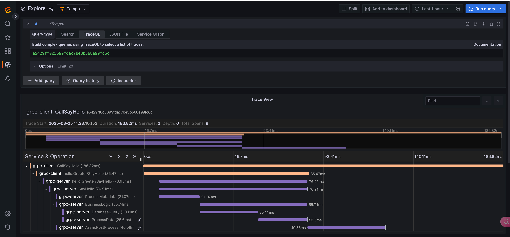

# Trace-For-Otel-Tempo-Grafana-Demo

启动命令：当前目录下执行```docker-compose up -d```

说明：
1. grafana容器启动后访问 http://localhost:3000/ ，并在Data Source配置Tempo数据源为http://tempo:3200 (使用service name作为docker网络内寻址)，并执行save && test 按钮进行测试。
2. 在Grafana内Import仓库里提供的grafana_template.json文件自动生成链路追踪的DashBoard
3. 服务端运行```go run grpc/server/main.go```
4. 客户端请求```go run grpc/client/main.go Jeff```



 建议配合文章一起使用[OpenTelemetry+Tempo+Grafana搭建分布式Trace监控](https://zonghay.github.io/archives/opentelemetry+tempo+grafana%E6%90%AD%E5%BB%BA%E5%88%86%E5%B8%83%E5%BC%8Ftrace%E7%9B%91%E6%8E%A7/)
